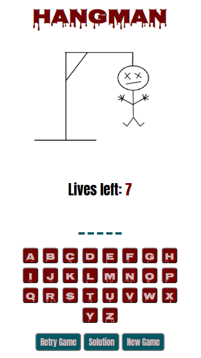

# hangman-game

### Technologies used:

This is a project using HTML, SCSS and JavaScript to create a hangman game.

### Requirements:

- Must use click or keypress events in JavaScript to trigger the events in the game (no refreshing to restart the game again).
- Mobile-first approach to the implementation.

### View of game:

